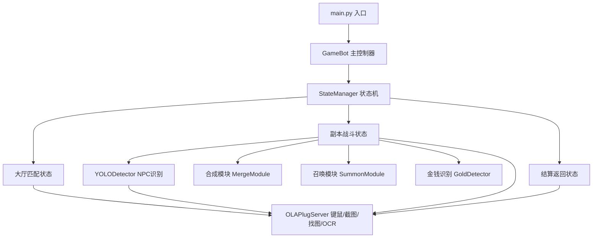
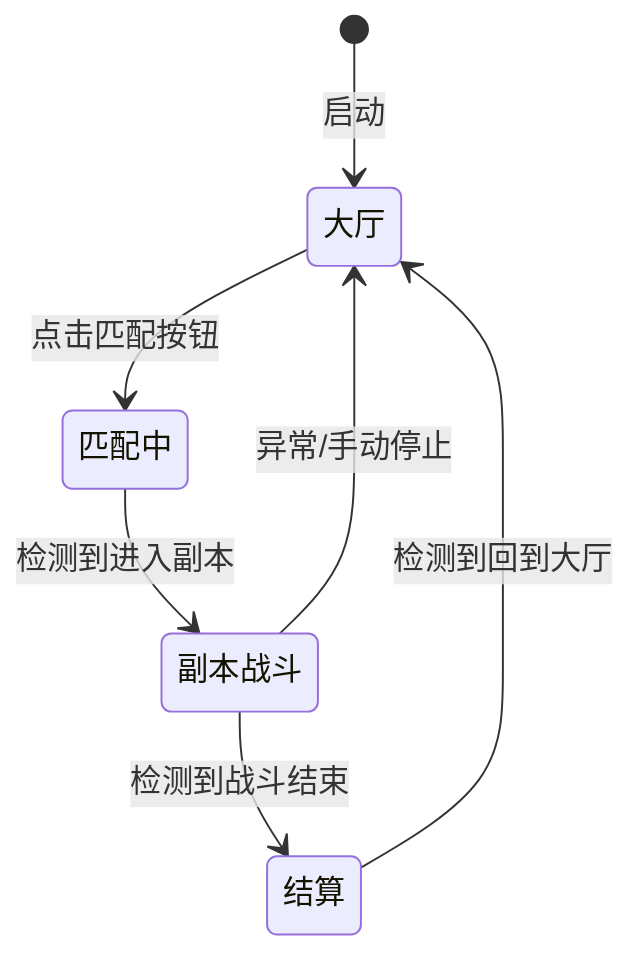

## 产品概述

一款用于"永远的蔚蓝星球"游戏的自动化工具，实现自动组队匹配和合作副本内自走棋战斗的自动操作。基于 Python + OLA 插件实现，控制台交互。

## 核心功能

- **自动组队匹配**：通过找图匹配游戏内匹配按钮，自动完成组队匹配 → 进入副本的流程
- **自动战斗循环**：
- YOLO 识别 NPC 区域内所有 NPC 的种类和星级（10-20 种，1-4 星）
- 自动合成：同种类同星级的 NPC，拖拽一个到另一个上面完成合成（最高 4 星不可合成）
- 自动召唤：有空格位且有足够金钱时，点击召唤按钮随机获取 NPC（价格递增，每 5 次新增格位）
- 金钱识别：通过 OCR 识别当前金钱数量
- **全流程循环**：组队匹配 → 进入副本 → 召唤+合成循环 → 战斗结束回大厅 → 再次匹配
- **控制台界面**：命令行启动/停止，显示运行状态和日志

## 基础版本范围

- 只实现召唤 + 合成功能
- 强化功能后续迭代
- 战斗策略后续优化

## 技术栈

- **语言**: Python 3.10+
- **自动化框架**: OLA 插件（已封装于 `olaplug/` 目录）
- **目标检测**: ultralytics（YOLOv8）加载 `yolov8/best.pt`
- **图像处理**: OLA 插件内置截图 + numpy（YOLO 输入格式转换）
- **UI 识别**: OLA 插件找图（MatchWindowsFromPath）+ OCR
- **用户界面**: 命令行（标准库 argparse + logging）

## 实现方案

### 核心架构：状态机 + 模块化

采用状态机模式驱动主循环，将每个阶段（大厅匹配、副本战斗、结算返回）作为独立状态，每个状态对应一个处理模块。战斗阶段内部按"识别→决策→执行"三步循环。

### 系统架构



### 主循环状态机



### 战斗内循环逻辑

```
while 战斗未结束:
    1. 截图 NPC 区域 → YOLO 检测 → 得到 [{name, star, cx, cy}, ...]
    2. 金钱 OCR 识别当前金额
    3. 合成决策：遍历检测到的 NPC，找到同 name + 同 star 且 star < 4 的配对
       → 拖拽合成
    4. 召唤决策：有空格位 + 金钱 >= 召唤价格
       → 点击召唤按钮
    5. 等待短时间（Delay），回到步骤 1
```

### 关键技术决策

**1. YOLO 推理方式**
OLA 插件无内置 YOLO 接口，使用 `ultralytics` 库加载 `best.pt`。截图通过 OLA 的 `GetScreenDataBmp` 获取 BMP 数据指针，再用 `GetImageBmpData` 转为 bytes，由 numpy 转为 RGB 数组后送入 YOLO 推理。优先复用 OLA 截图能力以保持绑定窗口坐标系一致。

**2. 坐标系**
绑定窗口后，所有 OLA 操作（MoveTo、截图坐标等）使用**窗口客户区坐标系**。YOLO 检测结果需为相对坐标，再乘以 NPC 区域的实际像素尺寸得到绝对坐标。YOLO 模型训练时使用的图像分辨率需与截图尺寸匹配（或做缩放映射）。

**3. 拖拽合成实现**
无原生拖拽 API，组合调用：`MoveTo(npc1_x, npc1_y)` → `Delay(50)` → `LeftDown()` → `Delay(80)` → `MoveTo(npc2_x, npc2_y)` → `Delay(50)` → `LeftUp()` → `Delay(200)` 等待动画完成。

**4. 找图模板**
所有 UI 按钮（匹配按钮、召唤按钮等）的截图模板放在 `assets/templates/` 目录。用户需首次手动截取这些模板图片。

**5. 金钱识别**
使用 OLA 的 `Ocr` 在金钱显示区域进行 OCR 识别，解析出数字金额。

**6. 可配置性**
窗口标题、NPC 区域坐标、按钮模板路径、召唤价格公式、循环间隔等均放入 `config.json` 配置文件，避免硬编码。

## 目录结构

```
f:\projects\weilanOla\blueball\
├── olaplug/                          # [现有] OLA 插件封装，不修改
├── yolov8/
│   └── best.pt                       # [现有] YOLO 模型，不修改
├── assets/
│   └── templates/                    # [NEW] UI 按钮找图模板目录
│       └── README.md                 # [NEW] 模板说明文档（指导用户截取模板）
├── src/
│   ├── __init__.py                   # [NEW] 包初始化
│   ├── main.py                       # [NEW] 入口文件，解析命令行参数，启动/停止 bot
│   ├── bot.py                        # [NEW] GameBot 主控制器，管理生命周期
│   ├── state.py                      # [NEW] 状态机定义（State 枚举 + StateManager 类）
│   ├── config.py                     # [NEW] 配置管理，加载 config.json
│   ├── ola.py                        # [NEW] OLA 插件封装层：初始化、绑窗、截图、找图、OCR、键鼠操作的统一封装
│   ├── detector.py                   # [NEW] YOLO 检测器：加载 best.pt 模型，接收截图数据，返回 NPC 列表
│   ├── gold.py                       # [NEW] 金钱识别：OCR 识别金钱区域，返回当前金额
│   ├── merge.py                      # [NEW] 合成模块：从 NPC 列表中找可合成配对，执行拖拽合成
│   └── summon.py                     # [NEW] 召唤模块：判断是否可召唤，执行点击召唤按钮
├── config.json                       # [NEW] 配置文件
├── requirements.txt                  # [NEW] 依赖声明（ultralytics, numpy, opencv-python）
└── start                             # [现有] 不修改
```

## 各模块职责

| 文件 | 职责 |
| --- | --- |
| `src/main.py` | 命令行入口，解析参数，初始化配置，启动 bot，注册热键（F12 停止） |
| `src/bot.py` | GameBot 类：初始化 OLA + YOLO，运行主循环，管理启停状态 |
| `src/state.py` | State 枚举（LOBBY, MATCHING, BATTLE, SETTLEMENT），StateManager 驱动状态转换 |
| `src/config.py` | 加载/校验 config.json，提供统一的配置访问接口 |
| `src/ola.py` | 封装 OLA 操作：`capture_region()`, `find_template()`, `ocr_text()`, `move_to()`, `drag()`, `click()` 等 |
| `src/detector.py` | YOLODetector 类：`load_model()`, `detect(screen_bmp_data, region)` → `List[NPCInfo]` |
| `src/gold.py` | GoldDetector 类：`detect_gold()` → `int` 金额 |
| `src/merge.py` | MergeModule：`find_merge_pairs(npcs)` → 找同种类同星级配对，`execute_merge(npc1, npc2)` → 拖拽 |
| `src/summon.py` | SummonModule：`can_summon(gold, slot_count, summon_count)` → bool，`execute_summon()` → 点击按钮 |


## 关键数据结构

```python
# NPC 检测结果
@dataclass
class NPCInfo:
    name: str          # NPC 种类名（如 "安妮"）
    star: int          # 星级 1-4
    cx: int            # 中心 x（客户区坐标）
    cy: int            # 中心 y（客户区坐标）
    confidence: float  # 置信度
```

## 性能与可靠性

- YOLO 推理频率：每 2-3 秒一次（NPC 区域截图 → 推理），避免 CPU/GPU 过载
- 合成操作后等待 200-300ms 确保动画完成，再重新检测
- 每次状态转换前加入超时检测，避免卡死
- 找图匹配阈值可配置，适配不同分辨率